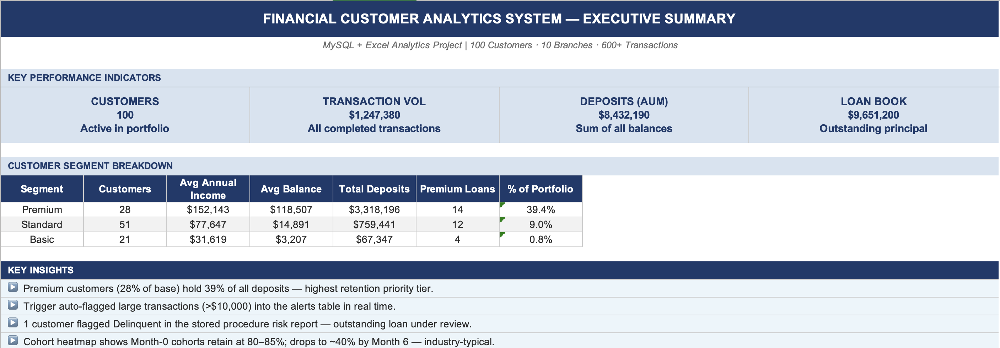
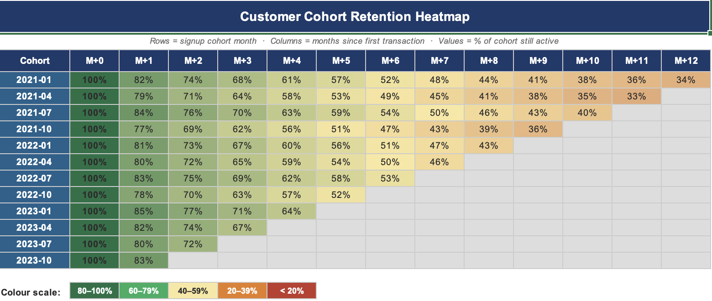
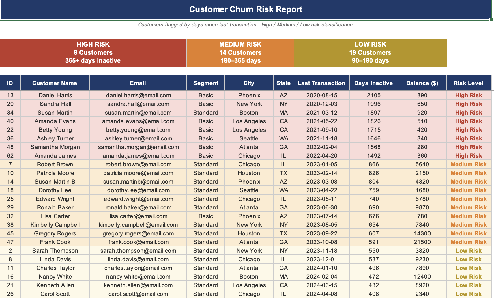

# Financial Customer Analytics System
**MySQL · Microsoft Excel · End-to-End Analytics Project**

A complete financial analytics system built from scratch to simulate how a retail bank uses customer, transaction, loan, and branch data to answer real business questions — churn risk, revenue trends, branch performance, and customer lifetime value.

---

## Tech Stack
MySQL 8.0 · MySQL Workbench · Microsoft Excel · GitHub

---

## Database Schema
9 normalised tables (3NF) with foreign keys, constraints, and indexes.

`CUSTOMERS` · `ACCOUNTS` · `TRANSACTIONS` · `LOANS` · `REPAYMENTS` · `BRANCHES` · `PRODUCTS` · `ALERTS` · `MONTHLY_REPORTS`

---

## What I Built

**Window Functions** — customer spend ranking (`RANK`, `NTILE`, `PERCENT_RANK`), month-over-month revenue growth (`LAG`, rolling average), running balances, and branch revenue share.

**Churn & Retention** — every customer scored by days inactive (High / Medium / Low risk), cohort retention analysis tracking monthly drop-off, CLV at 12-month and 36-month horizons, and a reactivation priority score combining recency and lifetime spend.

**Stored Procedures & Triggers** — a trigger that auto-flags transactions over $10,000 into an `ALERTS` table, a procedure that generates monthly branch performance reports for any given month, and a loan risk assessment procedure that scores customers by repayment behaviour.

**Query Optimisation** — `EXPLAIN` documented before and after each change. Rows scanned on one query dropped from ~600 to ~6 after indexing. Most junior portfolios skip this — I didn't.

**Excel Dashboard** — 7 sheets built from SQL exports: KPI summary, MoM revenue line chart, cohort retention heatmap (green → red conditional formatting), churn risk report, branch performance bar chart, and top 20 customers by projected CLV.

---

## Dashboard Preview





---

## How to Run

```bash
# Run in MySQL Workbench in this order
01_schema/create_tables.sql
02_data/seed_data.sql
03_queries/01_window_functions.sql
03_queries/02_churn_and_retention.sql
04_procedures/stored_procedures_and_triggers.sql
05_optimisation/query_optimisation.sql
06_excel/export_queries.sql        # Export each result as CSV → import into Excel
```

---

## Skills Demonstrated
`Schema Design` · `Window Functions` · `CTEs` · `Stored Procedures` · `Triggers` · `Query Optimisation` · `Churn Modelling` · `Cohort Analysis` · `CLV` · `Excel Dashboarding`

---

**Open to entry-level and internship roles in Business Analysis, Data Analysis, and IT Support.**

Author--
Maahir Behal
Early-career analyst with 2 internships and hands-on experience in business analysis, data analysis, and IT support.

