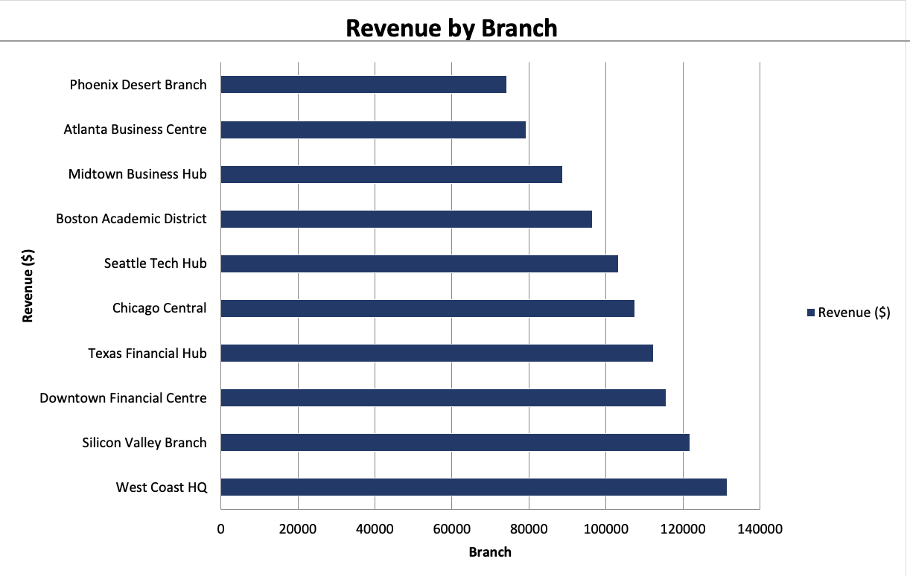

# Financial Customer Analytics System

## End-to-End SQL + Excel Analytics Project

This project is an end-to-end **Financial Customer Analytics System** built using **MySQL** and **Microsoft Excel**. It simulates how a retail bank can use customer, account, transaction, loan, and branch data to answer business questions around customer churn, retention, branch performance, revenue growth, and customer lifetime value.

This project uses **synthetic banking data** created for portfolio demonstration purposes.

---

## Project Objective

A retail bank needs a centralised analytics system to answer key business questions:

- Which customers are at risk of churning?
- Which customers are worth prioritising for retention?
- Which branches are underperforming?
- How does revenue change month over month?
- Which customers have the highest projected lifetime value?
- Which customer segments should be targeted for premium products?

The project connects **database design**, **SQL analysis**, **business logic**, and **Excel dashboarding** into one complete analytics workflow.

---

## Tools Used

| Tool | Purpose |
|---|---|
| MySQL | Database creation, data storage, and SQL analysis |
| MySQL Workbench | Query execution and schema management |
| Microsoft Excel | Dashboard creation and data visualisation |
| GitHub | Project documentation and version control |

---

## Project Structure

```text
financial-customer-analytics/
│
├── 01_schema/
│   └── create_tables.sql
│
├── 02_data/
│   └── seed_data.sql
│
├── 03_queries/
│   ├── 01_window_functions.sql
│   └── 02_churn_and_retention.sql
│
├── 04_procedures/
│   └── stored_procedures_and_triggers.sql
│
├── 05_optimisation/
│   └── query_optimisation.sql
│
├── 06_excel/
│   ├── export_queries.sql
│   └── financial_analytics_dashboard.xlsx
│
├── screenshots/
│   ├── executive_summary.png
│   ├── cohort_retention_heatmap.png
│   ├── churn_risk_report.png
│   └── branch_performance.png
│
└── README.md
---

## Folder Descriptions

| Folder / File | Description |
|---|---|
| `01_schema/` | Contains the database creation script with tables, primary keys, foreign keys, constraints, and indexes. |
| `02_data/` | Contains synthetic seed data for customers, branches, accounts, transactions, loans, and repayments. |
| `03_queries/` | Contains analytical SQL queries for customer ranking, churn detection, retention analysis, CLV, revenue growth, and branch performance. |
| `04_procedures/` | Contains stored procedures and triggers for automated reporting, alerts, dormant account reactivation, and risk reporting. |
| `05_optimisation/` | Contains query optimisation examples using indexes, EXPLAIN analysis, CTE rewrites, and improved filtering. |
| `06_excel/` | Contains export-ready SQL queries and the final Excel dashboard workbook. |
| `screenshots/` | Contains dashboard screenshots used for project presentation. |
| `README.md` | Main project documentation. |

---

## Database Overview

The database models a retail banking environment using a relational schema with the following main entities:

- Customers
- Branches
- Products
- Accounts
- Transactions
- Loans
- Repayments
- Alerts
- Monthly Reports

The schema includes primary keys, foreign keys, indexed relationship columns, transaction and account-level relationships, loan and repayment tracking, alert generation, and monthly branch reporting.

---

## Key Business Analyses

### 1. Customer Spend Ranking

Customers are ranked by total spend using SQL window functions such as `RANK()`, `NTILE()`, and `PERCENT_RANK()`.

This helps identify top customers, customer tiers, and potential premium product targets.

### 2. Month-over-Month Revenue Growth

Monthly revenue is analysed using previous-month comparison, rolling averages, and monthly aggregation by transaction date.

This helps identify revenue trends and changes in customer activity over time.

### 3. Churn and Dormancy Detection

Customers are classified into churn-risk groups based on transaction inactivity, including Active, Low Risk, Medium Risk, and High Risk.

This supports customer retention campaigns and reactivation planning.

### 4. Cohort Retention Analysis

Customers are grouped by their first transaction month and tracked over time to calculate retention percentages.

This helps show how customer retention changes across different cohorts.

### 5. Customer Lifetime Value Analysis

Customer Lifetime Value is calculated using historical and projected customer value.

This helps prioritise high-value customers for retention, premium product targeting, and relationship management.

### 6. Branch Performance Analysis

Branch-level analysis compares revenue, customer count, account balances, transaction volume, and loan activity.

This helps identify stronger and weaker performing branches.

---

## Dashboard Preview

### Executive Summary


---

### Cohort Retention Heatmap


---

### Churn Risk Report


---

### Branch Performance



---

## Excel Dashboard

The Excel dashboard contains multiple reporting views designed for business stakeholders.

| Dashboard Section | Purpose |
|---|---|
| Executive Summary | Shows high-level KPIs for customers, deposits, loans, and transactions. |
| Revenue Growth | Tracks month-over-month revenue and trend changes. |
| Customer Segments | Compares customer groups by size, balance, and value. |
| Churn Report | Identifies dormant and high-risk customers. |
| Branch Performance | Compares branches by revenue, customer base, and activity. |
| Cohort Heatmap | Shows customer retention by cohort and month. |
| Top Customers | Highlights customers with the highest projected value. |

---

## Automation Features

This project includes SQL automation through stored procedures and triggers.

### Triggers

- Flags large transactions automatically.
- Reactivates dormant accounts when new transaction activity occurs.

### Stored Procedures

- Generates monthly branch reports.
- Produces customer risk reports.
- Identifies customers eligible for segment upgrades.

These features demonstrate how SQL can support repeatable reporting and operational analytics.

---

## Query Optimisation

The project includes SQL optimisation examples using indexing strategy, `EXPLAIN` analysis, CTE rewrites, date filtering improvements, and avoiding inefficient correlated subqueries.

The goal is to show not only how to write analytical SQL, but also how to make queries more efficient and scalable.

---

## Skills Demonstrated

- SQL database design
- Relational modelling
- Primary and foreign keys
- Joins and aggregations
- Window functions
- Common Table Expressions
- Churn analysis
- Cohort retention analysis
- Customer Lifetime Value analysis
- Stored procedures
- Triggers
- Query optimisation
- Excel dashboarding
- Business analysis
- Data storytelling
- GitHub project documentation

---

## How to Run the Project

### Prerequisites

- MySQL 8.0 or later
- MySQL Workbench
- Microsoft Excel

### Steps

1. Create the database and tables by running:

```sql
01_schema/create_tables.sql
